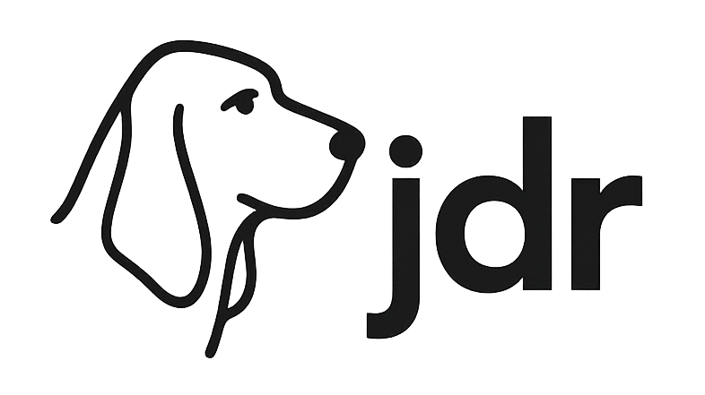

# jdr
_SOTA performance on "DeepSearch" benchmarks in < 1500 lines of code_

<p align="center">
  
</p>

`jdr` is a minimalist "deep search" reference implementation that achieves state-of-the-art performance on several benchmark datasets.  

Our goal was a system that "fits in your head" - this implementation is intended as a simple, strong starting point for building and testing more complex DeepSearch/DeepResearch approaches.

## Implementation Details
 - Base Model: `gemini-2.5-flash-preview-05-20`
 - Tools (via [native tool calling](https://docs.litellm.ai/docs/completion/function_call)):
   - [SERP](https://serpapi.com/) for search
   - [JINA Reader](https://r.jina.ai/) for page scraping

### "Double-Checking"

The only "fancy" thing we do is ["double-checking"](./jdr/agents/tool_call_agent.py#L148) - after the agent answers a question, we have it review it's work and make sure it didn't make a stupid mistake or obviously hallucinate.  This is a apparently a common failure mode - we observe that "double-checking" boosts performance substantially (e.g. 6 percentage point boost on FRAMES).

## Installation

Via pip:
```
pip install -e .
```

For development, we've been using [pixi](https://pixi.sh/latest/):
```
pixi install
pixi shell
```

## Usage

Single query:
```bash
export GEMINI_API_KEY=...
export SERPAPI_API_KEY=...
export JINA_API_KEY=...

python -m jdr.agents.tool_call_agent \
  --query "The lead actor who plays the regional manager of this popular mockumentary sitcom released in 2005 has the same initials as Santa Claus. What is the name of the voice actor for Flower in the latest animated film this actor starred in in 2024?"
```

Benchmarks:
```bash
export GEMINI_API_KEY=...
export SERPAPI_API_KEY=...
export JINA_API_KEY=...

python -m jdr.benchmark --dataset frames
python -m jdr.benchmark --dataset seal0
python -m jdr.benchmark --dataset simpleqa --sample 400
```

## Benchmarks

We benchmark on
- [FRAMES](https://huggingface.co/datasets/google/frames-benchmark)
- [SimpleQA](https://openai.com/index/introducing-simpleqa/)
- [SEAL0](https://huggingface.co/datasets/vtllms/sealqa)

### Performance
(See `Note on Auto-Graders` below for important context re: auto-graders.)

| Model | FRAMES | SimpleQA | SEAL0 | Link | Date | Notes |
|-------|--------|----------|-------|------|------|-------|
| jdr   | 81.2 | ~94 [1] | 40 | (Ours) | May2025 | FRAMES, SimpleQA and SEAL0 grader respectively |
| jdr   | 80.9 | ~94 [1] | 46.8 | (Ours) | May2025 | SimpleQA grader only |
| kimi-researcher | 78.8 | 93.6 | 36 | [Link](https://moonshotai.github.io/Kimi-Researcher/) | May2025 | All Kimi-Researcher results were evaluated using o3-mini |
| ii-researcher | 84.1 | | | [Link](https://github.com/Intelligent-Internet/ii-researcher) | May2025 | No grader information |
| OpenDeepSearch | 75.44 | 90.0 | | [Link](https://github.com/sentient-agi/OpenDeepSearch/) | Mar2025 | |
| you.com ARI | ~80 | | | [Link](https://you.com/articles/o3-mini-judges-ari-enterprise-winner-over-openai-deep-research) | May2025 | 79.7 w/ ODS grader ; 80.7 w/ modified FRAMES grader |

[1] Subset of 400 questions, due to budget constraints on our end

**There is no centralized leaderboard for these tasks - we did our best to find current SOTA systems, but we may be missing some.  If you're aware of others, please add them here!**

## Note on Auto-Graders

All of these benchmarks use free-form outputs that need to be graded with an LLM.  Unfortunately, people do not necessarily use standardized "auto-grader" implementations, which makes it hard to compare numbers.

We implement four auto-grader variants:
  - [FRAMES](jdr/evaluators.py#L93) as described in the [original paper](https://arxiv.org/abs/2409.12941)
    - **Caveat:** The paper does not provide code or LLM hyperparameters.
    - **Caveat:** The scoring LLM is no longer available.
  - [SEAL0](jdr/evaluators.py#L96) as described in the [original paper](https://arxiv.org/pdf/2506.01062)
    - **Caveat:** The paper does not provide code or LLM hyperparameters.
  - [SimpleQA](jdr/evaluators.py#L99) as implemented in their [Github repo](main/simpleqa_eval.py)
  - [OpenDeepSearch](jdr/evaluators.py#L102) as implemented in their [Github repo](https://github.com/sentient-agi/OpenDeepSearch/blob/main/evals/autograde_df.py#L21)

In the table above, we report what we think "the correct" grader is for each class, as well as the SimpleQA grader results for all problems, since this seems like the closest thing we have to a "uniform" auto-grader approach.  

**Community convergence on a standardized grading prompt, base model, and parameter settings for these kinds of tasks would be wonderful.**  We think the SimpleQA grader is probably appropriate for most of these kinds of tasks, and is already somewhat standardized.  However, we've seen different parameter settings used by different groups.  Additionally, the grader should probably be run multiple times per query to reduce variation coming from the scorer.

## DeepSearch vs DeepResearch

"DeepResearch" is the more commonly used term, [jina.ai] differentiates between the two well:
> DeepSearch runs through an iterative loop of searching, reading, and reasoning until it finds the optimal answer.
> DeepResearch builds upon DeepSearch by adding a structured framework for generating long research reports

We consider `jdr` to be a DeepSearch tool. 
